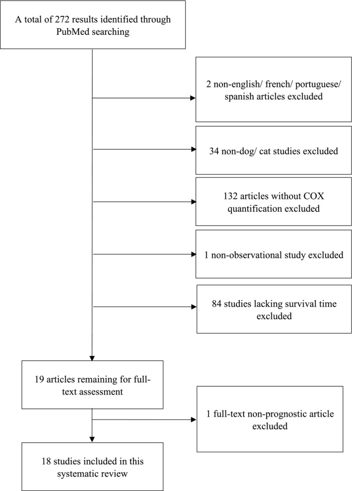
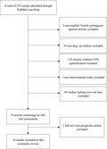

# The role of COX expression in the prognostication of overall survival of canine and feline cancer: A systematic review

## Evidence-Depth Caveat

This card is based on complete publication text. It is deep-extracted as a systematic review.

## One-Line Summary

A systematic review of 18 studies demonstrating that COX-2 is a negative prognostic factor in feline mammary tumors, while COX-1 is a negative prognostic factor in feline oral SCC.

## Why It Matters For Feline cancer

It clarifies the prognostic utility of COX isoforms in feline oncology, distinguishing COX-2 for mammary carcinomas and COX-1 for oral squamous cell carcinomas.

## Key Findings

### quoted_fact

* "Eighteen studies were analysed to evaluate the prognostic value of COX-1 and COX-2 in malignant neoplasia in dogs and cats."
* "COX-2 was shown to be a negative prognostic factor in canine and feline mammary tumours, canine mast cell tumour, canine melanoma, canine osteosarcoma and canine renal cell carcinoma."
* "COX-1 showed a negative prognostic value in feline oral squamous cell carcinoma (SCC)."

### source_supported_conclusion

* The available literature supports using COX-2 as a negative prognostic factor in feline mammary carcinoma.
* COX-1 expression has a documented negative prognostic value in feline oral squamous cell carcinoma (SCC), supporting its clinical use as a prognostic marker.

### llm_inference

* Standardization of COX immunohistochemical evaluation methodologies by tumor type is required to resolve high inter-study heterogeneity.

## Study Design Details

### PRISMA Flowchart

### Risk of Bias Summary

### Cohort Summary

| Parameter | Value |
|---|---|
| Study Type | Systematic Review |
| Database Queried | PubMed |
| Total Studies Analyzed | 18 |
| Key Feline Neoplasias | Mammary Tumours (COX-2 negative), Oral SCC (COX-1 negative) |

## Linked Entities

- diseases: [cancer]
- models: [systematic-review]
- endpoints: [overall-survival, COX, immunohistochemistry, prognosis]
- mechanisms: []
