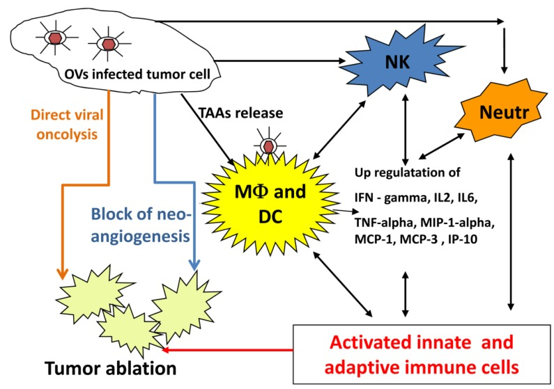

# Oncolytic virotherapy of canine and feline cancer

## Evidence-Depth Caveat

This card is based on the complete publication text. It is deep-extracted as a narrative and clinical review.

## One-Line Summary

A comprehensive review of oncolytic virotherapy in veterinary medicine, highlighting that ALVAC/NYVAC-fIL2 combined with surgery and radiotherapy prevents recurrence in feline fibrosarcomas.

## Why It Matters For Feline Cancer

Oncolytic virotherapy represents an innovative class of feline cancer immunotherapy. This review provides the primary clinical evidence for poxvirus-based recurrence prevention in feline fibrosarcomas, as well as preclinical data on adenoviral and vaccinia treatments.

## Key Findings

### quoted_fact

* "When combined with surgery and radiotherapy, treatment with either of these viruses [ALVAC-fIL2 and NYVAC-fIL2] prevented feline fibrosarcoma recurrence in cats."
* "Both wild type and genetically engineered oncolytic virus therapy appears to be as safe as standard anti cancer therapies."
* "There are very few clinical trials using OVs for canine or feline cancer patients."

### source_supported_conclusion

* Poxvirus vectors ALVAC-fIL2 and NYVAC-fIL2 demonstrate clinical efficacy in preventing recurrence of feline fibrosarcoma when used as adjuvant therapy with surgery and radiotherapy.
* GLV-5b451 (vaccinia virus expressing anti-VEGF single-chain antibody) shows preclinical efficacy in feline mammary carcinoma mouse xenografts.
* Oncolytic virotherapy has a highly favorable safety profile in cats, comparable to traditional therapies.

### llm_inference

* Given the lack of widespread clinical trials, OV therapies remain experimental and should be considered as adjunctive, rather than alternative, to standard-of-care surgical resection and radiation therapy.

## Study Design Details

### Mechanisms of Oncolytic Virotherapy

### Overview of Feline Applications

| Virus Family | Specific Agent | Feline Tumor Type | Stage of Evidence |
|---|---|---|---|
| Poxvirus | ALVAC-fIL2, NYVAC-fIL2 | Fibrosarcoma | **Clinical Trial** (Adjuvant) |
| Poxvirus | GLV-5b451 (anti-VEGF) | Mammary Carcinoma | Preclinical (Xenograft) |
| Adenovirus | Ad5-hsp-fIL-12 | Soft Tissue Sarcoma | Preclinical (In Vivo) |
| Poxvirus | Myxoma virus | Mammary Carcinoma / Fibrosarcoma | Preclinical (In Vitro) |

## Linked Entities

- diseases: [cancer, fibrosarcoma, mammary-carcinoma, soft-tissue-sarcoma]
- models: [mouse-xenograft, clinical-trial]
- endpoints: [tumor-regression, recurrence-prevention, immune-response]
- mechanisms: [oncolysis, anti-VEGF, IL-12-immunotherapy]
