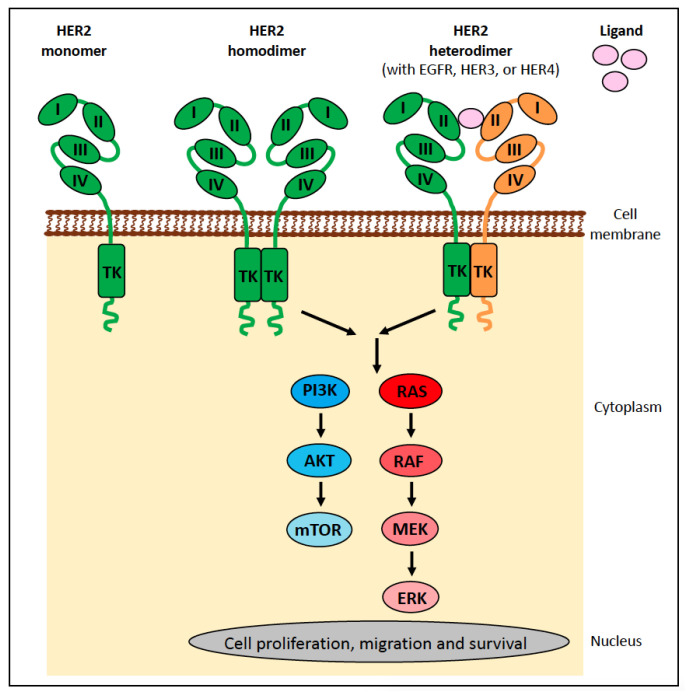
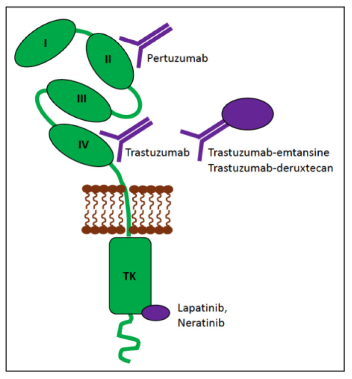
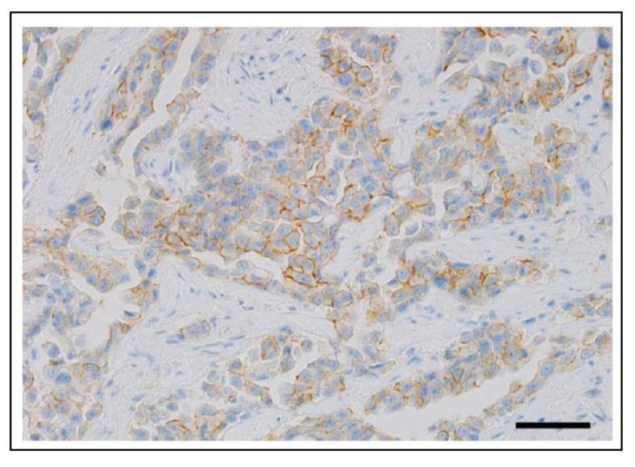

# Clinical Use of Molecular Biomarkers in Canine and Feline Oncology: Current and Future

## Evidence-Depth Caveat

This card is based on the complete publication text. It is deep-extracted as a clinical and molecular review.

## One-Line Summary

A 2024 review establishing a clinical framework for molecular biomarkers (diagnostic, prognostic, predictive, screening) in veterinary oncology, highlighting feline applications like KIT (mast cell tumors), PARR (alimentary lymphoma), and HER2 (mammary carcinoma).

## Why It Matters For Feline Cancer

Precision oncology is transitioning from research to clinical reality. This paper catalogs established diagnostic assays (like PARR clonality for distinguishing alimentary lymphoma from inflammatory bowel disease) and provides the molecular rationale for using anti-human HER2 antibodies and inhibitors in cats.

## Key Findings

### quoted_fact

* "Molecular biomarkers are central to personalised medicine for human cancer patients."
* "It [precision medicine] is gaining traction as part of standard veterinary clinical practice for dogs and cats with cancer."
* "Feline-specific biomarkers include KIT mutations (mast cell tumors), PARR clonality testing (alimentary lymphoma), and HER2 expression (mammary carcinoma)."

### source_supported_conclusion

* Molecular biomarkers in feline oncology are categorized into four distinct functional classes: diagnostic (e.g. PARR to confirm lymphoma), prognostic (e.g. KIT mutation to predict tumor behavior), predictive (e.g. HER2 to predict therapeutic response), and screening.
* High similarity in target receptor structure enables anti-human molecular diagnostic tools to cross-react with feline targets (such as HER2 on invasive mammary carcinoma cells).

### llm_inference

* PARR (PCR for Antigen Receptor Rearrangement) should be utilized in cats with ambiguous gastrointestinal infiltrates to definitively differentiate feline alimentary lymphoma from inflammatory bowel disease (IBD).

## Study Design Details

### HER2 Receptor Signaling Structure

Figure 19 illustrates the molecular topology of the HER2 receptor, showing the extracellular ligand-binding domains (I–IV), transmembrane segment, and intracellular tyrosine kinase domain that is highly conserved across species.

### Therapeutic Inhibition of HER2

Figure 21 outlines the therapeutic strategies targeting HER2 signaling, including monoclonal antibodies (such as trastuzumab and pertuzumab blocking extracellular domains III and II) and small molecule tyrosine kinase inhibitors (blocking the kinase domain).

### HER2 Protein IHC Expression in Feline Mammary Carcinoma

Figure 22 demonstrates highly invasive growth of feline mammary carcinoma and shows positive membranous HER2 protein expression in tumor cells detected via immunohistochemistry.

### Biomarker Classification Matrix

| Category | Clinical Utility | Feline Application | Key Targets |
|---|---|---|---|
| **Diagnostic** | Identifies tumor presence/type | Alimentary Lymphoma vs IBD | PARR Clonality |
| **Prognostic** | Predicts aggressive tumor behavior | Cutaneous Mast Cell Tumors | KIT Exon Mutations |
| **Predictive** | Predicts targeted drug response | Mammary Carcinoma | HER2 Overexpression |

## Linked Entities

- diseases: [cancer, mast-cell-tumor, lymphoma, mammary-carcinoma]
- biomarkers: [KIT, PARR, HER2]
- endpoints: [diagnostic, prognostic, predictive, screening]
- mechanisms: [somatic-mutations, receptor-tyrosine-kinase, gene-clonality]
- treatments: [precision-medicine, chemotherapy]
