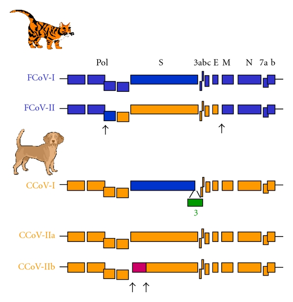

# Feline and Canine Coronaviruses: Common Genetic and Pathobiological Features

## Evidence-Depth Caveat

This card is based on the complete publication text. It is deep-extracted as a comparative virological review.

## One-Line Summary

A 2011 review examining the genetic relationship, recombination history, and pathobiology of feline and canine coronaviruses, detailing the classification into Type I and Type II genotypes.

## Why It Matters For Feline FIP

Understanding the genetic structures and cell-receptor interactions of feline coronaviruses (FCoVs) is essential for developing diagnostic markers and targeted therapeutics. The study highlights how recombination events with canine coronaviruses (CCoVs) and transmissible gastroenteritis virus (TGEV) resulted in Type II coronaviruses, which utilize aminopeptidase N (APN) as a functional receptor.

## Key Findings

### quoted_fact

* "Feline and canine coronaviruses are widespread among dog and cat populations, sometimes leading to the fatal diseases known as feline infectious peritonitis (FIP) and pantropic canine coronavirus infection in cats and dogs, respectively."
* "Coronaviruses have been known for about 50 years to be major agents of respiratory, enteric, or systemic infections."
* "FCoV and CCoV strains are classified into two main genotypes (Genotypes I and II) based on genetic relationships and recombination events."

### source_supported_conclusion

* CCoV and FCoV share extensive genetic homology. Recombination events in the spike (S) gene region have driven the evolution of Type II genotypes, which display modified host cell tropism and receptor dependencies.
* Comparative models using canine and feline coronaviruses help define common pathobiological mechanisms of systemic vasculitis and viral dissemination.

### llm_inference

* Broad-spectrum antiviral therapeutics developed for feline FIP (such as GC376 or GS-441524) are likely to exhibit clinical efficacy against pantropic CCoV infections in dogs due to highly conserved protease and polymerase target sequences.

## Study Design Details

### FCoV and CCoV Genetic Relationships

Figure 1 schematizes the phylogenetic relationships and genetic structures of Feline Coronavirus (FCoV) and Canine Coronavirus (CCoV) genotypes:

### Genotype Classification Matrix

| Genotype | Spike Protein Origin | Cellular Receptor | Key Representative Strains |
|---|---|---|---|
| **Genotype I** | Unique/Ancestral FCoV/CCoV | Unknown (non-APN) | FCoV-I (e.g. UCD1), CCoV-I |
| **Genotype II** | Recombinant with TGEV | Aminopeptidase N (APN) | FCoV-II (e.g. 79-1146), CCoV-II, TGEV |

## Linked Entities

- diseases: [FIP]
- models: [review]
- endpoints: [genetics, pathobiology, cell-tropism]
- mechanisms: [viral-recombination, receptor-binding]
